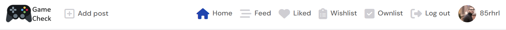

# Game Check

Game Check is a social media website for people to recommend videogames to fellow gamers.

The aim of Game Check is to allow players to recommend games to other players and thus be able to play games that have good recommendations.

Visit the deployed Game Check website here: [https://pp5-85rhrl-766ed649dea1.herokuapp.com/](https://pp5-85rhrl-766ed649dea1.herokuapp.com/)

## Features

### Existing Features

- __Navigation Bar__
    - Across the whole website there is a navigation bar on top which includes links to the Logo and Home which will take the user back to the homepage, there are also links for Feed, Liked, Wishlist, Ownlist, Log out and Profile.
    - This navigation bar will adapt to the screen size to improve the User Experience.
    - The Home, Feed, Liked, Wishlist and Ownlist links will stay blue whenever clicked to let the user know in which page they currently are.

    

- __Home page__
    - In the home page the user will find the posts in the center.
    - On the right side of the home page a panel with the most followed profiles is displayed.
    - A search bar is displayed on the top of the home page, where users can search a post either by the user, the game title, game genre or game platform.

    

- __Feed page__
    - The feed page will only display the posts of the users followed by the user.

- __Reaction buttons__
    - Below every post there are 4 buttons.
    - A heart shaped icon to like the post. Next to it the likes counter.
    - A dialog bubble that takes you to the post when clicked/tapped, next to it the number of comments.
    - A List icon to add the game to your wishlist, next to it the number of times this game is wishlisted.
    - A checked icon to add the game to your ownlist, next to it the number of users that own this game.

    
    
- __Liked page__
    - The liked page will only display the posts that are liked by the user.

- __Wishlist page__
    - The wishlist page will only display the posts of games that the user has wishlisted.

- __Ownlist page__
    - The ownlist page will only display the posts of games that the user owns.

- __Profile page__
    - In the profile page the user can update their profile picture, add a short bio and change their username and password.
    - The number of posts and followers is displayed as well as the number of users the user is following.

    

- __Posts__
    - Every logged-in user can make a post.
    - A game title, content, genre and platform must me filled/chosen before creating a post.
    - Users can add an image to their post.
    - Posts can also be edited by their respective owners.

    

- __Follow users__
    - A follow link is displayed next to each profile on the most followed profiles panel as well on the profile page of each user.
    - The user can follow other users so that they can see their posts on the feed page.

- __Comments__
    - To make social connections, every logged-in user can comment on every post.
    - Comments can also be edited by their respective owners.

    

- __Sign up__
    - To be able to create a post, follow other users, comment on posts as well as liking a post, wishlist or ownlist a game, the site visitor must create an account.

    

### Features Left to Implement

- __Add a messaging app so users can chat in realtime.__

## Technologies used

### Languages
- __Python__ - Used for the DRF backend functionality.
- __React.js__ - Used for frontend functionality.
- __HTML5__ - Used for the structure and content of the frontend.
- __JavaScript__ - Used for enhanced interactivity on the frontend.
- __CSS3__ - Used for the styling of the frontend.

### Tools & Frameworks
- __Github__ - Used for version control, bug reporting and hosting the repository.
- __Heroku__ - Used for deploying the website.
- __Cloudinary__ - Used for storing the images.
- __DRF__ - Django Rest Framework used for building the API in the backend.

## Testing

### Validator testing

- __HTML__
    - The HTML code was tested using the W3C Markup Validator and no errors were found.
            

- __CSS__
    - The CSS code was tested using the CSS Validation Service and no errors were found.
            

- __JavaScript__
    - The JavaScript code was tested using the JSHint static code analysis tool and no errors were found.

- __Python__
    - The code was passed through the Code Institute's PEP8 Python Linter with no errors found.

### Lighthouse

Lighthouse is an open-source automated tool to audit a page based on its Performance, Accessibility, Best Practices and Search Engine Optimization (SEO). This audit was performed and the results were good as seen below.
    